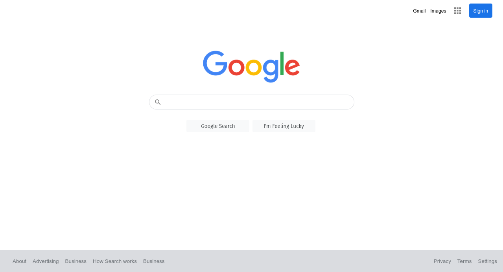

<h1>Google homepage</h1>
<ul>
 <li>This is a simple odin project to test my html and css.</li>
 <li>This is not an exact replica nor a functional one </li>
</ul>
 

 
<a href="https://www.theodinproject.com/paths/foundations/courses/foundations/lessons/html-css">Project Description From Odin</a>
 

 <a href="https://andrew-lamichhane.github.io/google-homepage/">Live demo</a>
